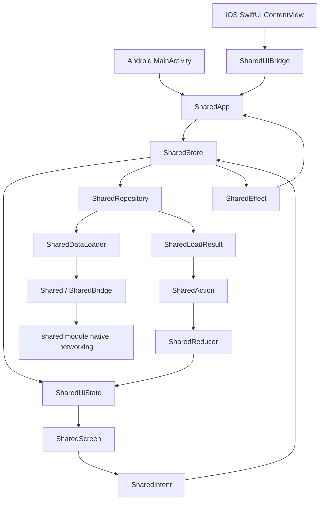

# KotlinNative Demo

This repository is a Kotlin/Native demo. It compiles Kotlin/Native code into Android native shared libraries (`.so`) and Apple frameworks that are consumed by app modules.

## What This Demo Shows

- Kotlin/Native shared library builds for Android ABIs.
- Packaging the native libraries into the Android app.
- Building and linking iOS framework artifacts from `ui` and `shared`.
- Building macOS arm64 Kotlin/Native binaries.
- A simple Compose UI that calls into native code.

## Project Structure

- `shared/`: Kotlin Multiplatform logic module (network/JNI/native core).
- `ui/`: Shared Compose UI module with MVI state management.
- `android/`: Android app module that packages and loads the native libraries.
- `iosApp/`: iOS app module (SwiftUI + XcodeGen) that links the `ui` framework built by `iosApp/scripts/prepare_kotlin_frameworks.sh`.

## How It Works (High Level)

- The `shared` module builds Kotlin/Native shared libraries for Android targets.
- The `ui` module hosts shared Compose UI and receives loaders from app layer.
- The `android` module copies those `.so` outputs into `jniLibs`.
- The Android app invokes native functions exposed by `libshared.so`.
- The iOS app links `ui` and `shared` frameworks under their `build/xcode-frameworks` outputs.
- The macOS target currently builds arm64 binaries only. A macOS app module is not included yet.

## MVI Architecture Flow



## Build

Android

```sh
./gradlew :android:assembleDebug
./gradlew :android:assembleRelease
```

Run the Android app from Android Studio by selecting the `android` run configuration, or install a built APK with:

```sh
adb install android/build/outputs/apk/debug/android-debug.apk
```

Windows

```sh
./gradlew :shared:runDebugExecutableMingwX64
```

iOS (with Xcode + XcodeGen)

```sh
cd iosApp
xcodegen
open iosApp.xcodeproj
```

Then run the `iosApp` scheme from Xcode. The pre-build script compiles the required `ui` framework and copies it into Xcode's framework search path.

macOS arm64 binaries

```sh
./gradlew \
  :shared:linkDebugSharedMacosArm64 \
  :shared:linkReleaseSharedMacosArm64 \
  :ui:linkDebugFrameworkMacosArm64 \
  :ui:linkReleaseFrameworkMacosArm64
```

Outputs:

- `shared/build/bin/macosArm64/debugShared/libshared.dylib`
- `shared/build/bin/macosArm64/releaseShared/libshared.dylib`
- `ui/build/bin/macosArm64/debugFramework/ui.framework`
- `ui/build/bin/macosArm64/releaseFramework/ui.framework`

There is currently no macOS app target to run directly. To run this on macOS, add an AppKit or SwiftUI macOS app and link `ui.framework`; the `ui` framework exports `shared`.

CI uses the same macOS arm64 Gradle tasks in `.github/workflows/ci-mobile.yml`.

## Notes

- For native, TLS is not supported because this demo uses Ktor CIO. [YouTrack: TLS sessions are not supported on Native platform](https://youtrack.jetbrains.com/issue/KTOR-7262)

- This is a demo project intended for learning and experimentation.

## Acknowledgements

- This README and parts of the setup were created with help from an AI assistant (OpenAI Codex).
