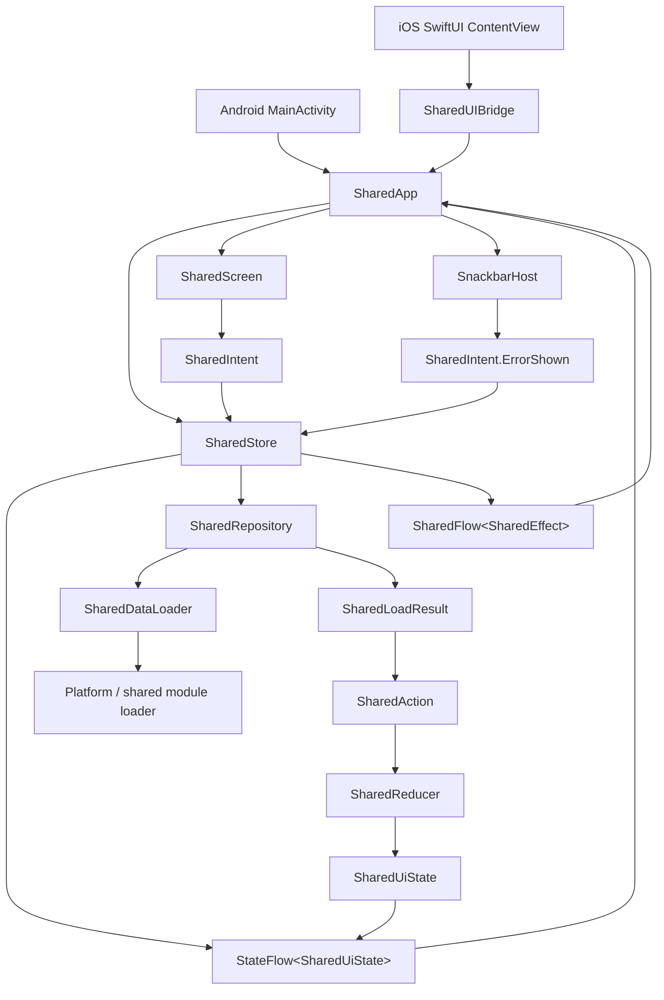
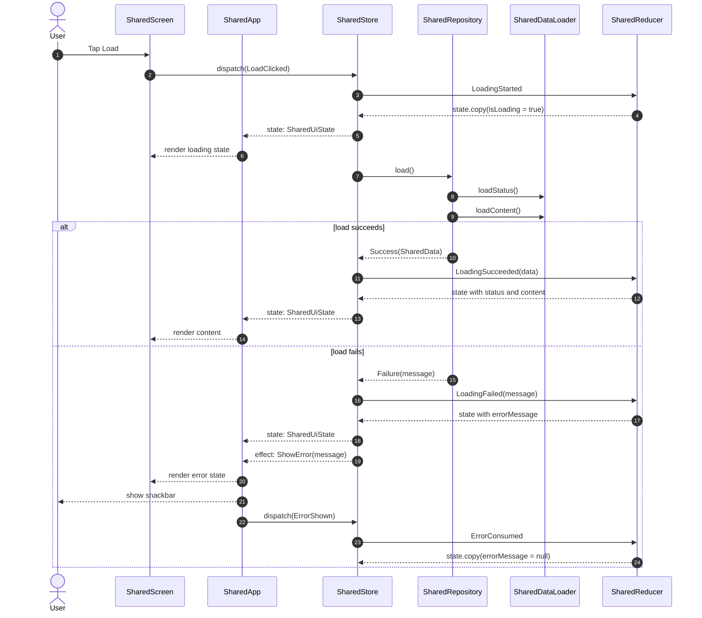

# UI Module MVI Architecture

本文档描述 `ui` 模块当前的 MVI 数据流。图表使用 Markdown 常见支持的 Mermaid 语法，可在 GitHub、JetBrains IDE Markdown 预览等环境中渲染。

## Component Flow

## Load Interaction

## Roles

- `SharedUiState`: 页面可持续渲染的状态，包括 `status`、`content`、`isLoading`、`errorMessage`。
- `SharedIntent`: UI 输入事件，目前包括 `LoadClicked` 和 `ErrorShown`。
- `SharedAction`: Store 内部交给 Reducer 的状态变更命令。
- `SharedReducer`: 纯状态转换逻辑，负责根据 `SharedAction` 生成新的 `SharedUiState`。
- `SharedEffect`: 一次性副作用事件，目前用于展示错误 Snackbar。
- `SharedStore`: MVI 中枢，接收 Intent、调用 Repository、触发 Reducer、发布 State 和 Effect。
- `SharedRepository`: 将 `SharedDataLoader` 的平台/共享数据加载结果包装为 `SharedLoadResult`。
- `SharedScreen`: 只消费 `SharedUiState` 并通过回调上报 `SharedIntent`。
